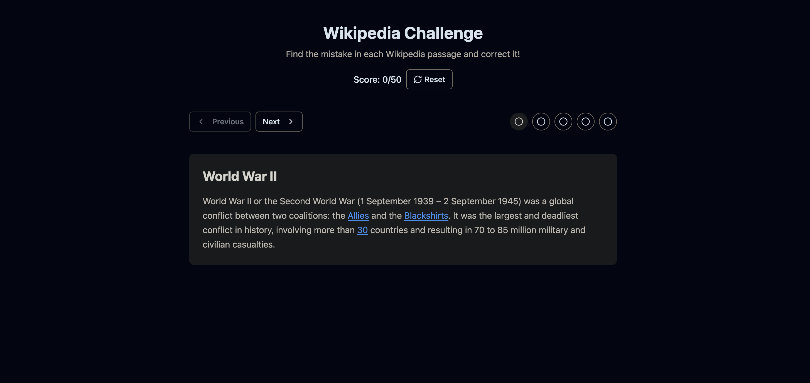

# Wikipedia Challenge Game

A daily puzzle game of spotting mistakes in Wikipedia-style articles. Become the editor Wikipedia doesn't really need.



## Overview

Citation Needed is an engaging browser-based game that tests your knowledge and attention to detail. Each day, players are presented with 5 Wikipedia-style articles that each contain one deliberate mistake. Your mission is to find the mistake, click on it, and then provide the correct answer.

## How to Play

1. **Read the Article**: Carefully read through each Wikipedia-style article.
2. **Find the Mistake**: Look for hyperlinks within the text. One of these links contains a factual error.
3. **Click the Mistake**: When you spot the incorrect link, click on it.
4. **Provide the Correction**: Enter the correct term in the dialog that appears.
5. **Score Points**: Earn 5 points for finding the mistake and 5 more for the correct answer.
6. **Share Your Results**: After completing all articles, share your results with friends in a Wordle-style format.

## Scoring

- 5 points for correctly identifying the mistake
- 5 additional points for providing the correct answer
- Maximum possible score: 50 points (10 points per article × 5 articles)

## Daily Challenge

The game features a daily set of articles that is the same for everyone playing on that day. Your progress is saved locally, so you can return to finish the challenge later.

## Features

- 🧠 Test your knowledge with challenging factual mistakes
- 🔗 Interactive Wikipedia-style articles with multiple hyperlinks
- 📊 Wordle-style results sharing
- 💾 Progress automatically saved to continue later
- 🌙 Clean, accessible UI design

## Development

This project is built with:

- React 18
- TypeScript
- React Router
- Tailwind CSS
- shadcn/ui components

### Project Structure

```
src/
├── components/
│   ├── ui/           # shadcn/ui components
│   └── wiki-game/    # Game-specific components
├── data/
│   └── articles.ts   # Mock Wikipedia articles data
├── types/
│   └── wiki-game.ts  # TypeScript definitions
├── pages/
│   ├── Index.tsx     # Main application page
│   └── NotFound.tsx  # 404 page
└── lib/
    └── utils.ts      # Utility functions
```

### Getting Started

1. Clone the repository:

   ```bash
   git clone https://github.com/yourusername/wikipedia-challenge.git
   cd wikipedia-challenge
   ```

2. Install dependencies:

   ```bash
   npm install
   ```

3. Start the development server:

   ```bash
   npm run dev
   ```

4. Open your browser and navigate to `http://localhost:5173`

### Building for Production

```bash
npm run build
```

## Future Enhancements

- User accounts and global leaderboards
- Difficulty levels
- Custom categories (history, science, pop culture, etc.)
- Integration with actual Wikipedia API for more varied content

## License

MIT

## Acknowledgments

- Inspired by games like Wordle and Wikipedia's "Did You Know" section
- Built with React and Vite
